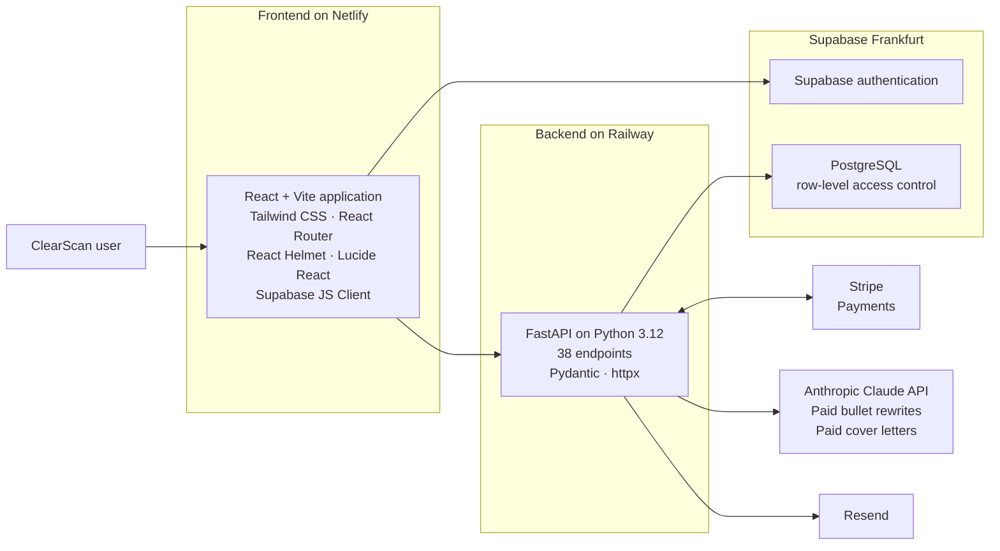

# Architecture

This diagram intentionally stays at the verified system-boundary level. It does not represent undocumented private modules or internal service boundaries.

## Verified deployment boundaries

- The React and Vite frontend is hosted on Netlify.
- The FastAPI backend is hosted on Railway.
- PostgreSQL and authentication use Supabase, with the database in the Frankfurt region.
- Row-level access control is enabled in Supabase/PostgreSQL.
- Payments are handled by Stripe; no card data is stored.
- Anthropic Claude API calls are limited to paid bullet rewrite suggestions and paid cover-letter generation.
- GitHub Actions runs the automated tests. Production deploys automatically from the main branch: the frontend on Netlify and the backend on Railway, built from a Dockerfile.
