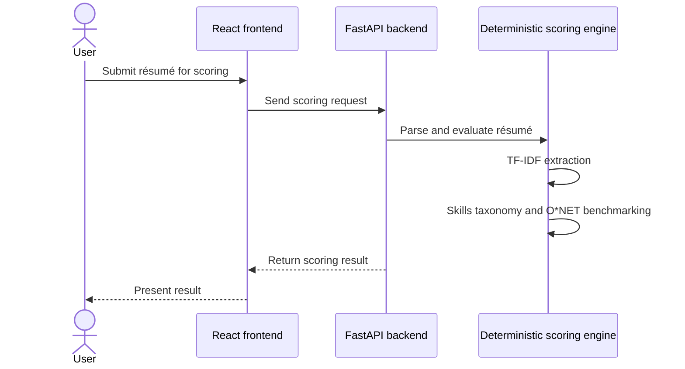
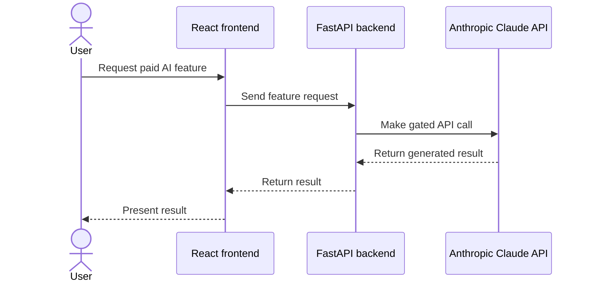
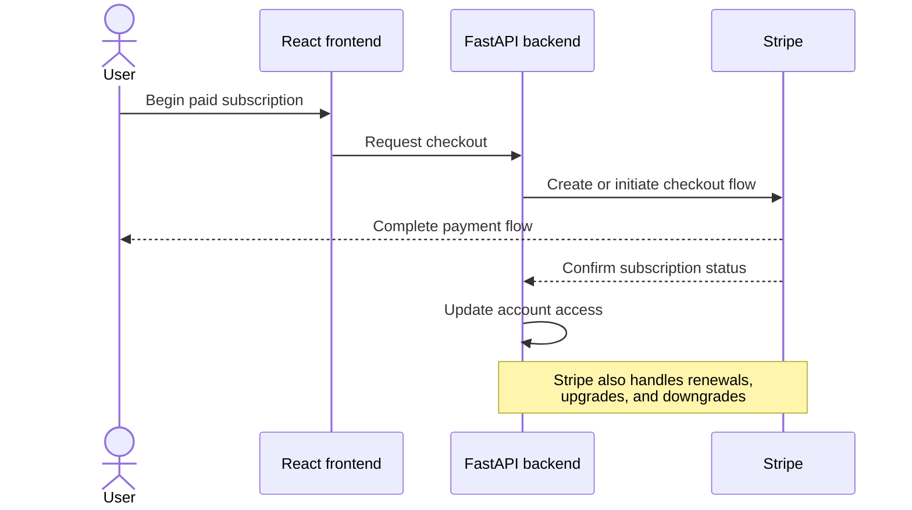

# Request and Payment Flows

The flows below contain only confirmed product behavior and intentionally remain at a high-level system boundary.

## Résumé upload and scoring

The measured end-to-end parse time is under 6 seconds. The core scoring path is deterministic and does not call an LLM.

## Premium Claude features

Claude API calls occur only when a paid user invokes one of these gated features:

1. AI-assisted bullet rewrite suggestions
2. AI-generated cover letters

## Checkout and subscription lifecycle

Stripe payments are live. Payments are handled by Stripe; no card data is stored. Stripe handles upgrades, renewals, and downgrades.

